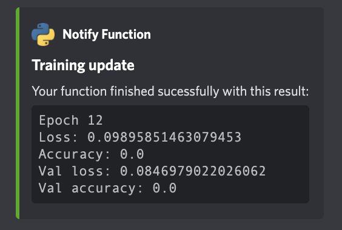

# ML Workflow
This library help to create models with identifiers, checkpoints, logs and metadata automatically, in order to make the training process more efficient and traceable.

## Requirements

- Tensorflow 2.5 or higher.
- [notify-function](https://pypi.org/project/notify-function/#description) 1.5.0 or higher.

## Usage

This library has two main functions:
 - `build`: to build a model in a defined structure of folder.
 - `train`: to train a model with a internal callbacks to save metrics with Tensorboard, save the model with checkpoints and send notification to discord channel, email or telegram (all this is optional).

### Build method
The build method is used to create a model in a defined structure of folder. As below:

```
`models_folder`
└─ `model_name`
   └─ `run_id`
      ├─ logs                               
      │  ├─ train
      │  ├─ validation
      ├─ `model_name`_`model_params`_checkpoint.h5
      └─ `model_name`_params.json
```


#### Parameters
```python
def custom_builder(input_shape) -> tf.keras.Model:
  """
  You can define this function to create one or more models.
  With the parameters send to this function you can create the different models that you want.
  The function MUST return a model of type `tf.keras.Model`.
  """
  model = tf.keras.models.Sequential([
    tf.keras.layers.Input(input_shape),
    tf.keras.layers.Dense(units=512, activation='relu'),
    tf.keras.layers.Dense(units=512, activation='relu'),
    tf.keras.layers.Dense(units=1, activation='sigmoid')
  ])
  return model

model, run_id, model_ident, check_path, path_model = mlw.build(
  model_name='model_dense', # Name of the model
  models_folder='./models', # Path to folder where models will be saved
  run_id=None, # Optional run id to load model
  builder_function=custom_builder, # Function to build your or yours models
  model_params={ 'input_shape': (2, 1) }, # Parameters for builder function
  compile_params={ # Parameters for model compilation, see documentation tf.keras.models.compile
    'optimizer': 'adam', 'loss': 'mse',
    'metrics': ['accuracy']
  },
  load_model_params={} # Parameters for model loading, see documentation of tf.keras.models.load_model
)
```

If you want to load a trained model you must send the parameter `run_id`, and you can skip the parameters like: `builder_function`, `model_params` and `compile_params`.

> Note: If your model use custom SubClass for custom Layers you must send the parameter `load_model_params` with the parameter `custom_objects` with the custom class. see documentation of tf.keras.models.load_model

#### Return

- `model`: the model built.
- `run_id`: the run id of the model.
- `model_ident`: the model identifier.
- `check_path`: the path to the checkpoint file.
- `path_model`: the path to the model file.


### Train method

The train method is used to train a model.

#### Parameters

```python
mlw.train(
  model=model, # The tf keras model
  check_path=check_path, # Path to the model checkpoint
  path_model=path_model, # Path to the model folder
  train_ds=train_ds, # Training dataset, could be a tf.data.Dataset, a list of tensors or a tensor
  val_ds=val_ds, # Validation dataset, could be a tf.data.Dataset, a list of tensors or a tensor
  batch=32, # Batch size
  epochs=100, # Number of epochs
  initial_epoch=0, # Initial epoch
  checkpoint_params={ # Parameters for model checkpoint, see documentation tf.keras.callbacks.ModelCheckpoint
    'monitor': 'accuracy', 'verbose': 1,
    'save_best_only': False, 'save_freq':'epoch'
  },
  params_notifier={ # Parameters for notifier, see documentation https://pypi.org/project/notify-function/#description
    'title': 'Training update',
    'webhook_url': os.environ.get('WEBHOOK_URL'),
    'frequency_epoch': 20 # This will send a notification every 20 epochs, by default it is every epoch
  }
)
```

If you loaded a trained model you should specify the initial epoch. Don't change the paths like `check_path` and `path_model`, because they are already setted properly when you loaded the model with the `build` method. Also don't send the key `filepath` on the `checkpoint_params` because it is already setted properly. inside the method.

If you want use `notify-function` lib you must send the parameter `params_notifier`. To see how to use and what do this library you can see the documentation of [notify-function](https://pypi.org/project/notify-function/#description). The message will have the epoch number and the values of each metric that you defined for your model.





> If you use `notify-function` and you specify email maybe this will add a delay to the training process. To avoid this you can use another methods more faster like discord webhooks or telegram message or instead use the key `frequency_epoch` on the `params_notifier` reduce the rate of notifications.

## FAQs

If you have any question find a bug or feedback, please contact me with a email to [enmanuelmag@cardor.dev](mailto:enmanuelmag@cardor.dev)

Made with ❤️ by [Enmanuel Magallanes](https://cardor.dev)
